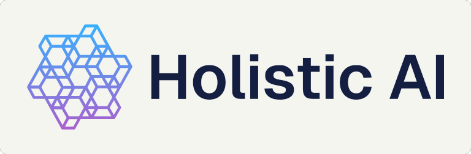

<p align="center">
  <picture>
    <source media="(prefers-color-scheme: dark)" srcset="https://raw.githubusercontent.com/holistic-ai/surface/main/docs/assets/logo-lockup-inverse.png">
    
  </picture>
</p>

<p align="center"><strong>What AI runs here, and what it costs.</strong></p>

<p align="center">
  <a href="https://github.com/holistic-ai/surface/actions/workflows/ci.yml"></a>
  <a href="https://crates.io/crates/surface-cli"></a>
  <a href="https://holistic-ai.github.io/surface/guide/building/"></a>
  <a href="https://holistic-ai.github.io/surface/getting-started/installation/"></a>
  <a href="LICENSE"></a>
</p>

<p align="center">
  <a href="https://holistic-ai.github.io/surface/">Documentation</a> ·
  <a href="https://holistic-ai.github.io/surface/getting-started/quickstart/">Quickstart</a> ·
  <a href="https://holistic-ai.github.io/surface/guide/privacy/">Privacy</a> ·
  <a href="https://holistic-ai.github.io/surface/reference/cli/">CLI</a>
</p>

<p align="center">
  
</p>

A single binary that scans your own machine and tells you four things: which AI tools are installed, which AI sites you use, how many tokens those tools have spent, and what that came to in dollars. No account, no daemon, no telemetry. It reads files that are already on your disk and shows you what is in them.

## Install

```sh
# macOS and Linux
curl -fsSL https://raw.githubusercontent.com/holistic-ai/surface/main/install.sh | sh
```

```powershell
# Windows, PowerShell
irm https://raw.githubusercontent.com/holistic-ai/surface/main/install.ps1 | iex
```

```bash
#Windows, cmd.exe — irm and iex are PowerShell only
powershell -NoProfile -ExecutionPolicy Bypass -Command "irm https://raw.githubusercontent.com/holistic-ai/surface/main/install.ps1 | iex"
```

```sh
# Cargo, on any of the three
cargo install surface-cli    # the crate is surface-cli; the binary is surface
```

The installer detects your platform, verifies the download against the release's
`SHA256SUMS`, and puts one binary on your `PATH` — no sudo, no profile edits. It
is [`install.sh`](install.sh), 127 lines, worth reading before you pipe it to a
shell. Prebuilt archives for all six targets are on
[Releases](https://github.com/holistic-ai/surface/releases), each carrying a
build provenance attestation you can check with `gh attestation verify`;
[installation](https://holistic-ai.github.io/surface/getting-started/installation/)
covers doing it by hand, and `cargo install` needs a C toolchain for the bundled
SQLite.

## Use

```sh
surface              # scan, then open the dashboard
surface --json       # scan, print JSON, exit
surface --offline    # never touch the network
surface --check      # show resolved paths and settings, then exit
surface --demo       # the dashboard on mock data, scanning nothing
```

`tab` cycles views, `1`–`6` jump, `j`/`k` move, `w` regroups the charts by day,
week or month, `?` for help, `q` to quit.

Configuration is optional: [`surface.example.toml`](surface.example.toml)
documents every setting and its default, and `surface --check` prints where it is
looked for.

## What it reads

| | Where it looks | What it records |
|---|---|---|
| **Tools** | `PATH`, config directories, editor extensions, running processes, installed apps | Which of 18 AI tools are present, and which can execute code on your machine |
| **Sites** | Browser history for 10 browsers (Chromium and Firefox families) | Visit counts for 30 known AI domains — domain, count, last-seen date, nothing else |
| **Usage** | Transcripts Claude Code, Codex and OpenCode already write | Tokens per day, tool and model, attributed to the git repo the work happened in |
| **Cost** | LiteLLM's public price table | The above, priced — plus a subscription comparison if you configure one |

The first run reads every transcript, which on a large corpus takes a while.
Every run after it reads only the bytes that were appended — typically under a
second.

### The 18 tools it recognises

**Can act** means the tool can execute code or take actions on this machine on a
model's behalf — the one judgement surface makes. **Tokens** means it also writes
a transcript surface can read, so it contributes usage and cost rows; the other
fifteen are detected but contribute no numbers, because they write nothing
readable.

| | Tool | Vendor | Kind | Can act | Tokens |
|:-:|---|---|---|:-:|:-:|
|  | **Claude Code** | Anthropic | coding agent | ✅ | ✅ |
|  | **Claude Desktop** | Anthropic | assistant |  |  |
|  | **Codex CLI** | OpenAI | coding agent | ✅ | ✅ |
|  | **ChatGPT Desktop** | OpenAI | assistant |  |  |
|  | **OpenCode** | SST | coding agent | ✅ | ✅ |
|  | **OpenClaw** | OpenClaw | autonomous agent | ✅ |  |
|  | **Cursor** | Anysphere | editor | ✅ |  |
|  | **Windsurf** | Codeium | editor | ✅ |  |
|  | **GitHub Copilot** | GitHub | extension |  |  |
|  | **Aider** | Aider | coding agent | ✅ |  |
|  | **Goose** | Block | autonomous agent | ✅ |  |
|  | **Hermes Agent** | Nous Research | autonomous agent | ✅ |  |
|  | **Gemini CLI** | Google | coding agent | ✅ |  |
|  | **Amp** | Sourcegraph | coding agent | ✅ |  |
|  | **Cline** | Cline | extension | ✅ |  |
|  | **Continue** | Continue | extension | ✅ |  |
|  | **Ollama** | Ollama | local runtime |  |  |
|  | **LM Studio** | LM Studio | local runtime |  |  |

Each logo is that tool's own mark, set on a uniform chip so the column reads as
one set and stays legible in GitHub's light and dark themes. They are checked in
under [`docs/assets/tools/`](docs/assets/tools/) rather than hotlinked, so the
README needs no third-party request; every file's origin is recorded in
[`SOURCES.md`](docs/assets/tools/SOURCES.md). Each mark remains the trademark of
its owner, used here only to identify the tool surface detects.

Alongside the tools: **30 AI domains** across **10 browsers**, and **3 token
sources**. The full tables, including the exact executable, config path, app name
and process each tool is detected by, are in
[Coverage](https://holistic-ai.github.io/surface/reference/coverage/). Every table
is best-effort and expected to go stale — a tool absent from it is simply not
reported, and nothing is silently misattributed.

| | |
|---|---|
| **Binary** | 2.06 MB, static, no runtime dependencies |
| **Warm scan** | ~400 ms — 6 ms tools, 330 ms browser history, 50 ms transcripts |
| **Cold scan** | ~19 s once, reading 900 MB of transcripts; ~50 ms thereafter |
| **Dependencies** | 12 direct, 99 in the tree |
| **Tests** | 246, no fixture files and no network |
| **Platforms** | macOS, Linux, Windows — x86-64 and arm64 |
| **MSRV** | 1.88 (set by ratatui's proc-macro chain, tested in CI) |
| **Privilege** | Runs unprivileged. Never elevates, never prompts |
| **Network** | One optional request, for model prices. `--offline` skips it |

Measured on an M-series Mac with 8 AI tools installed and 900 MB of transcripts.
The browser scan dominates a warm run because a domain `LIKE` filter cannot use
an index; the transcript read is 50 ms warm because it reads only appended bytes.

## Privacy

- **Nothing is transmitted.** No server, no account, no telemetry. The only
  outbound request is the price table, and `--offline` skips it.
- **No message content**, at any setting. Transcripts are parsed for token counts
  and model names only.
- **No URLs, paths, query strings or page titles** from browser history. The
  AI-domain filter runs *inside* SQLite, so the rest of your browsing is never
  loaded at all — there is a test that fails if a conversation id reaches a result.
- **No paths in the ledger.** A working directory becomes a git remote slug
  (`owner/name`) during the scan and the path is discarded, along with branch
  names and session ids. This matters because the ledger is written to disk.
- **Read-only and unprivileged.** Never elevates, never writes outside its own
  state directory, opens browser databases read-only and immutable.

What it *cannot* see is reported rather than hidden: Safari's history needs Full
Disk Access, so it shows up as an unreadable browser instead of quietly counting
as zero AI usage. Full detail in
[privacy](https://holistic-ai.github.io/surface/guide/privacy/).

## Costs, and where they are wrong

- **Unpriced is not free.** A model missing from the price table shows as
  `▲ unpriced`, never `$0.00`, and a total above unpriced models is marked `≥`
  because it is a floor.
- **Local models are free**, and shown as `local` rather than `$0.00`, because the
  two mean different things.
- **These are API list rates.** Put what you actually pay in
  `[cost.subscriptions]` and the Cost view compares the two. Without that, the
  plan a tool itself names — in the account file it keeps on this disk, or
  beside the token counts in its transcripts — is priced at its list rate and
  marked an estimate. The plan's name is the only thing read from those files,
  never the credentials beside it, and a tool naming no plan is never guessed
  at.
- **Cache reads are billed at cache rates** and reasoning tokens at output rates,
  which is how the providers that distinguish them do it.

## Develop

```sh
git clone https://github.com/holistic-ai/surface
cd surface
cargo run                        # scan this machine, open the dashboard
```

Four commands, all of which CI runs. Get them passing before opening a pull
request:

```sh
cargo fmt --all
cargo clippy --workspace --all-targets -- -D warnings
cargo test                       # 246 tests, no fixtures and no network
cargo run -- --json --offline    # the scan must degrade, never fail
```

Needs Rust 1.88 or newer. Nothing else — no task runner, no code generation, no
submodules. Tests live beside the code they exercise and point
`SURFACE_STATE_DIR` at a temp directory, so a test run never touches your real
profile.

**One dependency needs a C toolchain**: SQLite, compiled from source by
`rusqlite`'s `bundled` feature. Browser history and OpenCode's token store both
need it, so it is on by default — but it is opt-out:

```sh
cargo build --no-default-features    # pure Rust, no C compiler needed
```

That build is 1.20 MB instead of 2.06 MB and drops the Sites view and OpenCode
token counts, keeping tool detection plus Claude Code and Codex usage — and it
says so rather than showing empty views. Released binaries have the feature on, so
installing one never compiles C.

**Docs** are Material for MkDocs with the rustdoc reference folded in by
`scripts/rustdoc_hook.py`:

```sh
uv venv && uv pip install -r docs/requirements.txt
uv run mkdocs serve                  # http://127.0.0.1:8000/surface/
```

Contributor detail — what each CI job checks, the three classes of test, why the
release profile omits `panic = "abort"` — is in
[building from source](https://holistic-ai.github.io/surface/guide/building/).


> [!WARNING]
> **surface is in development.** It is below `1.0`, so minor releases may contain
> breaking changes. Those are always listed under **Breaking changes** in
> [`CHANGELOG.md`](CHANGELOG.md) — see
> [Stability](https://holistic-ai.github.io/surface/reference/stability/) for what
> is covered and what is not. Pin an exact version if you script against surface
> today.

## Contributing

[`CONTRIBUTING.md`](CONTRIBUTING.md) has the checks CI runs and what makes a
change easy to accept; adding a tool, domain or browser is the most common
contribution and mostly means editing a table. Vulnerabilities go through
[`SECURITY.md`](SECURITY.md) rather than the issue tracker. Maintainers cutting a
release want [`RELEASING.md`](RELEASING.md).

## Contributors

<a href="https://github.com/holistic-ai/surface/graphs/contributors">
  
</a>

## Supported by

<a href="https://www.holisticai.com">
  
</a>

## Licence

Apache License 2.0 — see [LICENSE](LICENSE).
